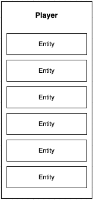

# Player

Player is small structure which represent connected player and joined to room

:::tip Tip

Player itself has no state.

:::

Player contains only name and array of entities which he has own;

#### Player structure
