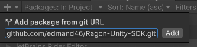

# Get started

### Ragon Simple Server
Simple server can be downloaded from releases from github:
- [Download](https://github.com/edmand46/Ragon/releases)

### Ragon Unity SDK

### Installing

After project creation add Ragon Unity SDK package

Open Unity Package Manager, press "+", press on "Add package from git URL"



and past next:

```
https://github.com/edmand46/Ragon-Unity-SDK.git
```

### Usage
Ragon Unity SDK has two different api levels

- Easy using via prototyping Components :
- Advanced using via custom build components;

In next tutorial we will use prototyping components