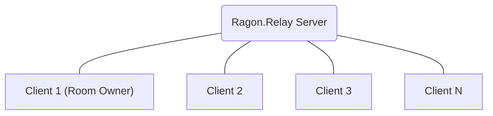
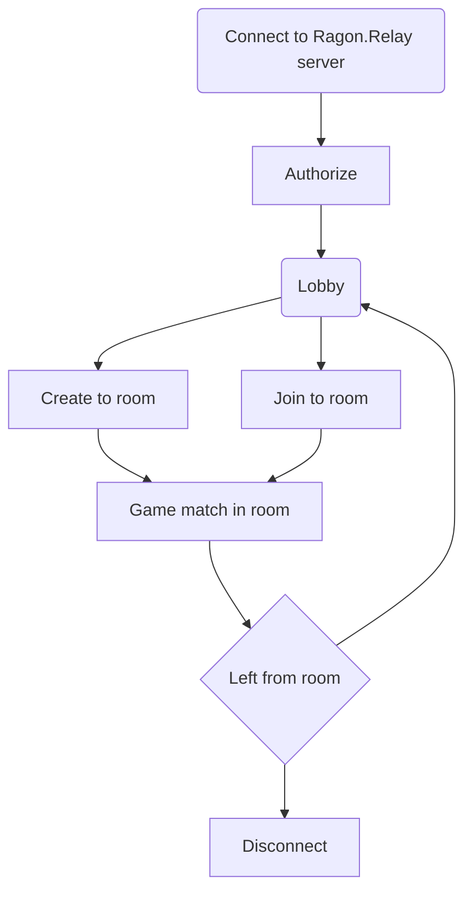

# Overview

Ragon server is a network solution in the form of a relay, the solution consists of two components

- **Relay Server**
- **Client SDK** (**Unity SDK** or **C# SDK**)

### Replication

There are two ways to work with a network:

**Events** (**reliable**):
Used to call required remote functions, similar to RPC in purpose. (open door, shoot, etc.)

**Network properties** in objects (**unreliable**):
Used to synchronize the state of the game object (lives, ammo, position, etc.)

**Room Owner**: Similar host in client-server model, state of all networked objects stored on server. Therefore, after the current room owner leaves the game session, the next player will become the new owner

### Entity

The basic unit in the network is the entity that contains the network state, and has the ability to replicate events.

Entities that were initially on the map are static, and their owner will be the owner of the room, entities that were created after the connection are dynamic, and their owner is the player who created them.

There are two types of entities:
* Static
* Dynamic

### Architecture

### Lifecycle
