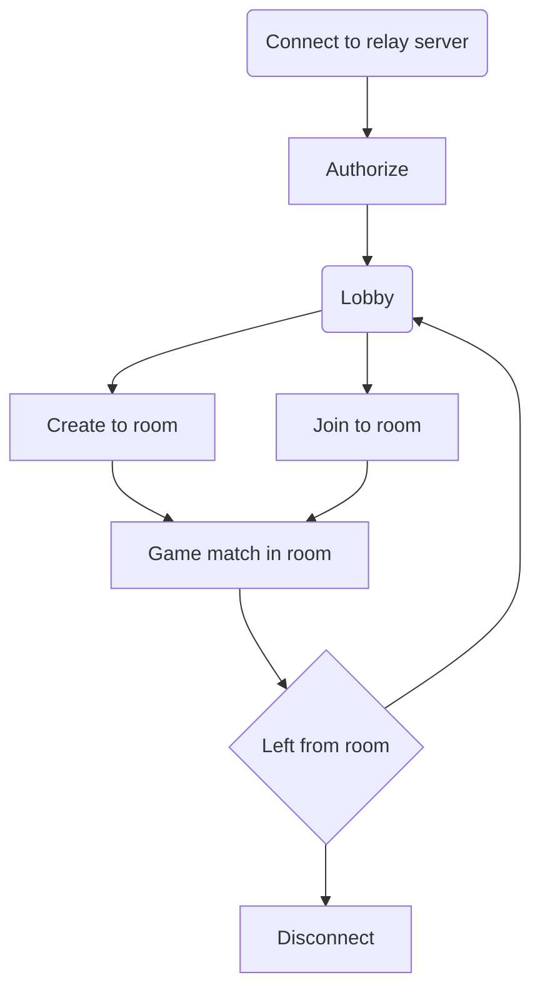

# Overview

### Lobby

You can create or join to room by maps or id, room always has an owner, if the owner left, will be selected next owner the room

### Replication

There are two ways to work with a network:

**Events** (**reliable**):
Used to call required remote functions, similar to RPC in purpose.

**Network properties** in objects (**unreliable**):
Used to synchronize the state of the game object (lives, ammo, position, etc.)

Also state of all networked objects stored on server.

### Lifecycle
