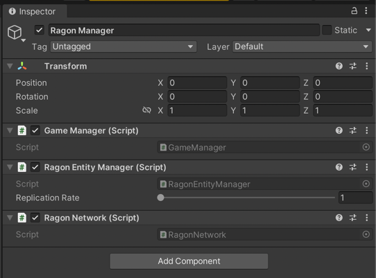

# Basic setup

After you installed Unity SDK, and downloaded **Ragon Simple Server**, let's begin

### Ragon Server

For first start our server, unzip and launch executable depends from your OS:

- For MacOS **Ragon.SimpleServer**
- For Windows **Ragon.SimpleServer.exe**
- For Linux **Ragon.SimpleServer**

### Unity

### Setup scene

Create empty game object with name for example ``Ragon Manager``, add next components:

- Ragon Network
- Ragon Entity Manager


### Game Manager

Create script ``Game Manager`` and implement Ragon interface ```IRagonListener``` :
```
public class GameManager : MonoBehaviour, IRagonListener
  {
    public void OnConnected()
    {
      Debug.Log("Connected");
    }
    
    public void OnAuthorized(string playerId, string playerName)
    {
      Debug.Log("Authorized");
    }
    
    public void OnJoined()
    {
      Debug.Log("Joined");
    }

    public void OnFailed(string message)
    {
      Debug.LogError("Failed with " + message);
    }

    public void OnLeaved()
    {
      Debug.Log("Leaved");
    }

    public void OnDisconnected()
    {
      Debug.Log("Disconnected");
    }

    public void OnPlayerJoined(RagonPlayer player)
    {
      Debug.Log("On Joined " + player.Name);
    }

    public void OnPlayerLeft(RagonPlayer player)
    {
      Debug.Log("On Left " + player.Name);
    }

    public void OnOwnerShipChanged(RagonPlayer player)
    {
      Debug.Log("New room owner " + player.Name);
    }

    public void OnEvent(RagonPlayer player, ushort evntCode, RagonSerializer payload)
    {
      Debug.Log("Event " + evntCode);
    }

    public void OnLevel(string sceneName)
    {
      Debug.Log("Level " + sceneName);
    }
  }
```

In ```Start``` method we should attach RagonEntityManager and specify ip and port to server 

```
    private void Start()
    {
      var entityManager = GetComponent<RagonEntityManager>(); 
 
      RagonNetwork.AddListener(this);
      RagonNetwork.SetManager(entityManager);
      RagonNetwork.Connect("127.0.0.1", 4444);
    }
```

After we was connected will be called ```OnConnected``` in this place we should request authorization with key and would we like name:
```
    public void OnConnected()
    {
      Debug.Log("Authorizing...");
      var randomName = $"Player {Random.Range(100, 999)}";
      RagonNetwork.Session.AuthorizeWithKey("defaultkey", randomName, Array.Empty<byte>());
    }
```
Next step is create or join to room, where specify minimal amount of players, maximum and also map:

```
    public void OnAuthorized(string playerId, string playerName)
    {
      Debug.Log("Authorized");
      RagonNetwork.Session.CreateOrJoin("Example", 1, 20);
    }
```

Last step, we should tell server what ready to receive updates for this map:
```
    public void OnLevel(string sceneName)
    {
      Debug.Log("Level " + sceneName);

      RagonNetwork.Room.SceneLoaded();
    }
```

Now drag and drop GameManager on GameObject on scene:



And press Play, after you should see next logs


Success! You connected to **Ragon Simple Server** and authorized!

#### Completed sources:
```
[RequireComponent(typeof(RagonEntityManager))]
  public class GameManager : MonoBehaviour, IRagonListener
  {
    private void Start()
    {
      var entityManager = GetComponent<RagonEntityManager>();
 
      RagonNetwork.AddListener(this);
      RagonNetwork.SetManager(entityManager);
      RagonNetwork.Connect("127.0.0.1", 4444);
    }
    
    public void OnConnected()
    {
      Debug.Log("Authorizing...");
      var randomName = $"Player {Random.Range(100, 999)}";
      RagonNetwork.Session.AuthorizeWithKey("defaultkey", randomName,Array.Empty<byte>());
    }
    
    public void OnAuthorized(string playerId, string playerName)
    {
      Debug.Log("Authorized");
      RagonNetwork.Session.CreateOrJoin("Example", 1, 20);
    }

    public void OnJoined()
    {
      Debug.Log("Joined");
    }

    public void OnFailed(string message)
    {
      Debug.LogError("Failed with " + message);
    }

    public void OnLeaved()
    {
      Debug.Log("Leaved");
    }

    public void OnDisconnected()
    {
      Debug.Log("Disconnected");
    }

    public void OnPlayerJoined(RagonPlayer player)
    {
      Debug.Log("On Joined " + player.Name);
    }

    public void OnPlayerLeft(RagonPlayer player)
    {
      Debug.Log("On Left " + player.Name);
    }

    public void OnOwnerShipChanged(RagonPlayer player)
    {
      Debug.Log("New room owner " + player.Name);
    }

    public void OnEvent(RagonPlayer player, ushort evntCode, RagonSerializer payload)
    {
      Debug.Log("Event " + evntCode);
    }

    public void OnLevel(string sceneName)
    {
      Debug.Log("Level " + sceneName);
    }
  }
```